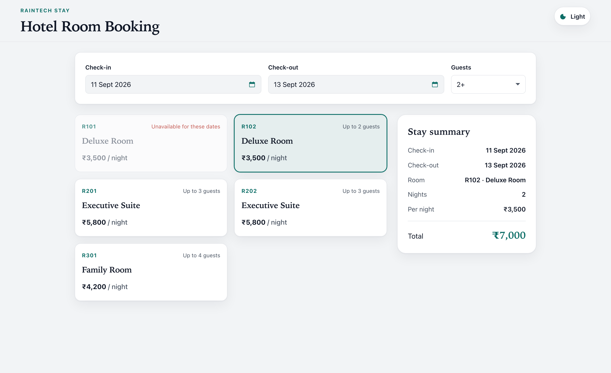
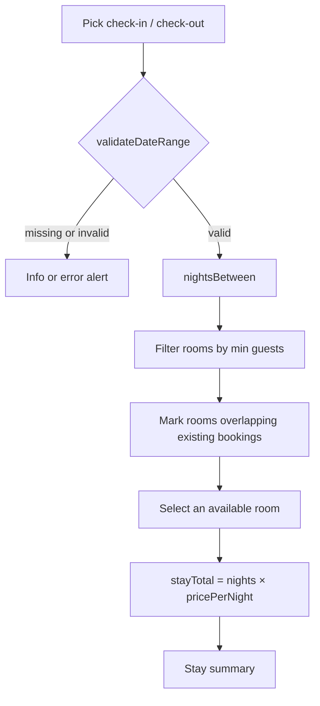

# Hotel Room Booking

Single-page React app for the Raintech Software Limited coding test. Guests pick dates and a room; the page shows nights and a total in INR.

There is no backend, auth, or payment. Rooms and a few overlapping bookings are hardcoded. Date, night, overlap, and price rules live in pure domain functions — the UI only collects a stay and renders the result.



## Run locally

```bash
npm install
npm run dev
```

Open the URL Vite prints (usually `http://localhost:5173/`).

```bash
npm test      # domain tests (dates, nights, overlap, calendar)
npm run lint
npm run build # TypeScript check + production bundle
```

Node is required. No other services.

## What it does

- Custom calendar for check-in and check-out (not a native date input)
- Check-out must be after check-in; check-in cannot be in the past; same-day checkout is invalid
- Guest-count filter hides rooms below occupancy
- Rooms that overlap an existing stay are marked unavailable (checkout day is treated as free)
- Total = nights × nightly rate, formatted as INR
- Light / dark theme, persisted, with a circular reveal from the toggle

Out of scope: confirming a reservation, APIs, login, payments.

## Stack

- React 19
- TypeScript (`strict`, `noUncheckedIndexedAccess`)
- Vite 8
- CSS modules + design tokens
- Vitest (domain tests)
- oxlint

## Architecture

Dependencies point inward: **UI → domain**. Data adapters implement hardcoded lists; React does not call `fetch`.

```
src/
  app/                         # composition root (shell + theme + page)
  features/booking/
    domain/                    # pure rules (no React, no DOM)
      tests/                   # one test file per domain module
    data/                      # hardcoded rooms and existing bookings
    lib/                       # display helpers (ISO date → locale string)
    ui/
      <component>/             # component + colocated *.module.css
  shared/
    lib/                       # theme, INR formatting
    ui/                        # PageShell, Field, Alert, ThemeToggle
    styles/tokens.css          # color, space, type tokens
```

| Layer | Owns | Must not own |
| --- | --- | --- |
| Domain | Date validation, nights, overlap, calendar grid, room types | React, CSS, storage |
| Data | Room list, sample bookings derived from today | Pricing rules |
| UI | Forms, calendar popover, alerts, summary | Night/price math |
| Shared | Theme, tokens, primitives | Booking rules |
| App | Wires the page and theme toggle | Business logic |

Money is stored as integer rupees. Dates are local calendar days (`YYYY-MM-DD`), compared with UTC year/month/day so timezones do not shift the stay.

## Booking flow



1. `BookingPage` holds check-in, check-out, selected room, and guest filter.
2. `validateDateRange` runs on every change. Invalid dates produce an alert and no night count.
3. Changing either date clears the selected room so a previous choice cannot stick to a new stay.
4. `getExistingBookings(today)` builds three sample stays relative to today. `isRoomBooked` flags overlap: ranges `[checkIn, checkOut)` — a new stay may start on another booking’s checkout day.
5. The guest filter keeps rooms where `maxGuests >=` the chosen count.
6. Selecting an available room sets `total = nights × pricePerNight`. Unavailable selection shows an error and no total.

### Date rules

| Rule | Result |
| --- | --- |
| Empty check-in / check-out | Prompt to choose the missing date |
| Check-in before today | Error: cannot be in the past |
| Check-out ≤ check-in (including same day) | Error: check-out must be after check-in |
| Valid range | Nights = calendar days between the two dates |

The calendar week starts Monday. Days before today, and months before the minimum date, are not selectable.

## Sample data

| Code | Type | Price / night | Max guests |
| --- | --- | --- | --- |
| R101, R102 | Deluxe Room | ₹3,500 | 2 |
| R201, R202 | Executive Suite | ₹5,800 | 3 |
| R301 | Family Room | ₹4,200 | 4 |

Existing bookings (relative to **today**):

- **R101** — tomorrow, 3 nights
- **R201** — in 7 days, 3 nights
- **R301** — in 14 days, 2 nights

To see unavailability: check in tomorrow and check out 4+ days later — R101 should be booked.

## Theme

- Inline script in `index.html` sets `data-theme` before paint to avoid a flash.
- Stored under `localStorage` key `hotel-booking-theme`. If unset, the OS color scheme is used.
- Toggle applies a circular View Transition from the button. `prefers-reduced-motion` skips the animation.

## Tests

`npm test` runs Vitest against `src/features/booking/domain/tests/`:

- `date-range.test.ts` — past check-in, same-day checkout, missing dates
- `stay.test.ts` — night count and `nights × rate`
- `overlap.test.ts` — checkout day is free; overlapping room is booked
- `calendar-month.test.ts` — Monday-start grid and month navigation
